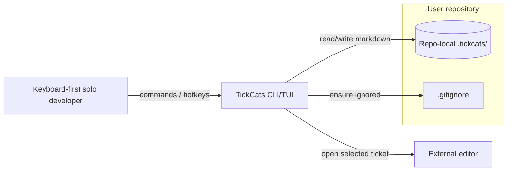
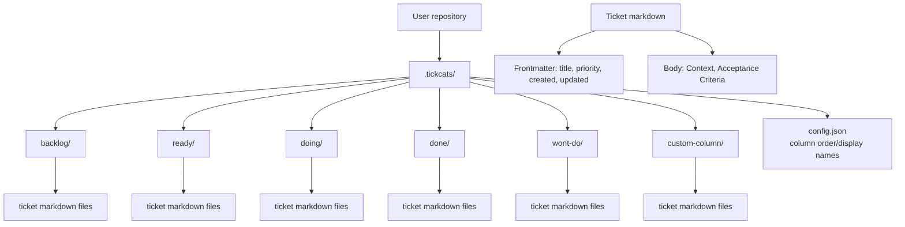
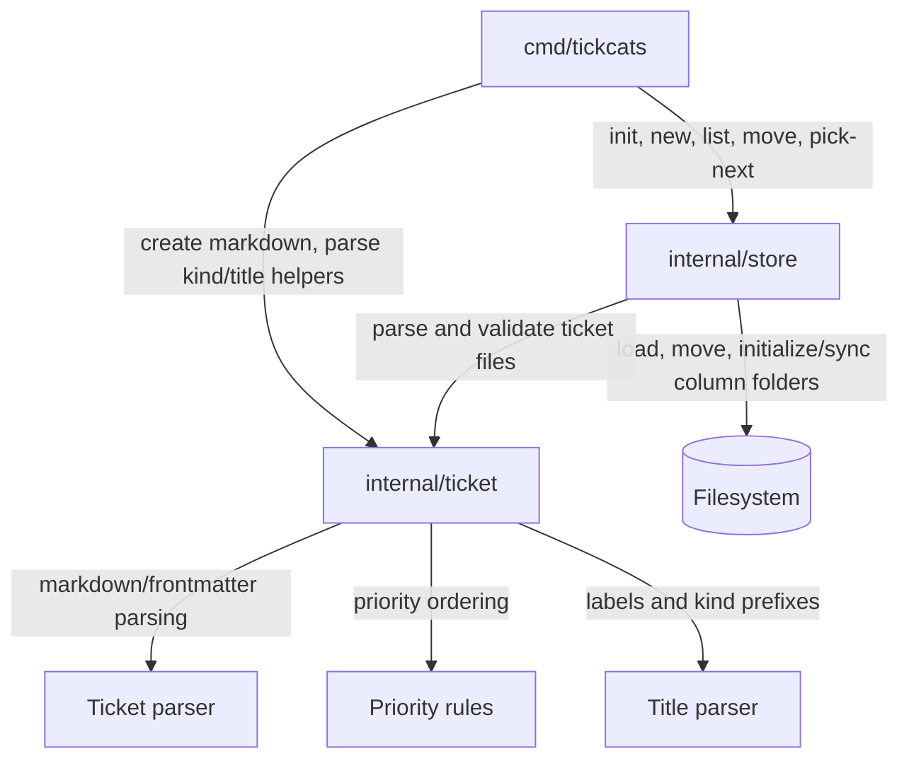
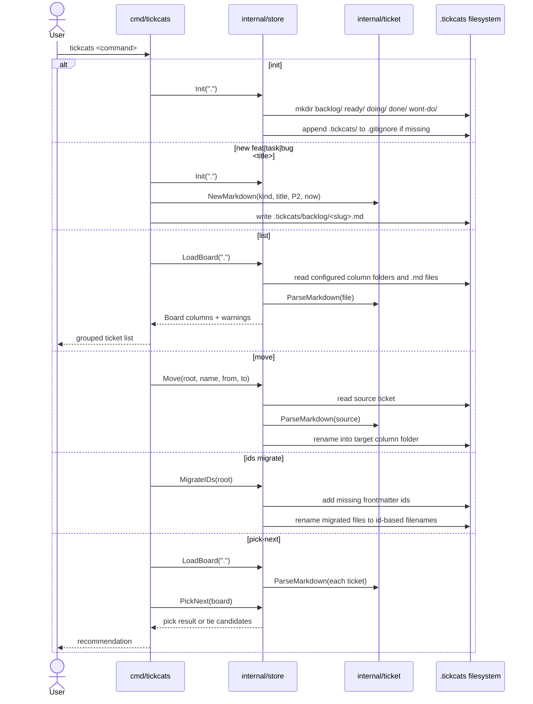
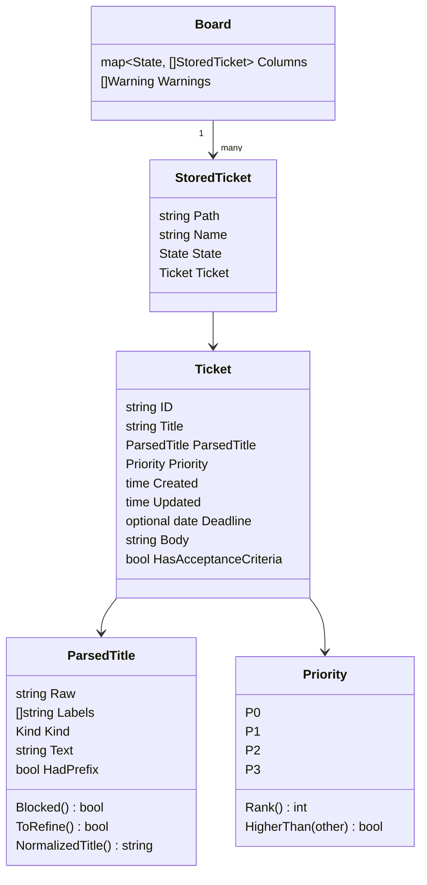
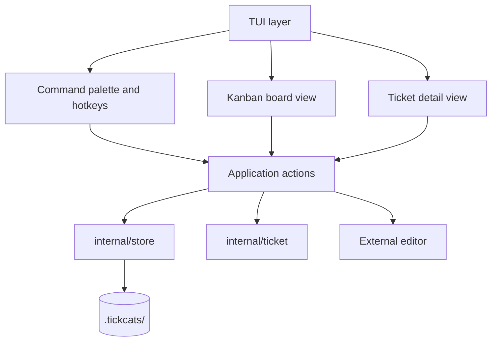

# TickCats Architecture Diagrams

These Mermaid diagrams describe the v1 local CLI/TUI architecture. The source of truth is the filesystem: ticket status comes from the column folder containing each markdown file, not from ticket frontmatter.

## System context



## Local storage layout



## Package-level architecture



## Runtime command flow



## Pick-next rule architecture

```mermaid
flowchart TD
    A[Board loaded from filesystem] --> B[Use Ready column only]
    B --> C[Filter with IsReadyForPick]
    C --> D[State == ready]
    C --> E[Non-empty title]
    C --> F[Non-empty Acceptance Criteria]
    C --> G[No [blocked] label]
    C --> H[No [to refine] label]
    D --> I[Eligible candidates]
    E --> I
    F --> I
    G --> I
    H --> I
    I --> J[Sort by Priority.HigherThan]
    J --> K[Sort ties by Created ascending]
    K --> L[Sort exact ties by filename]
    L --> M{Multiple same rank?}
    M -->|Yes| N[Needs manual choice]
    M -->|No| O[Return single recommendation]
```

## Data model



## Planned v1 TUI boundary


