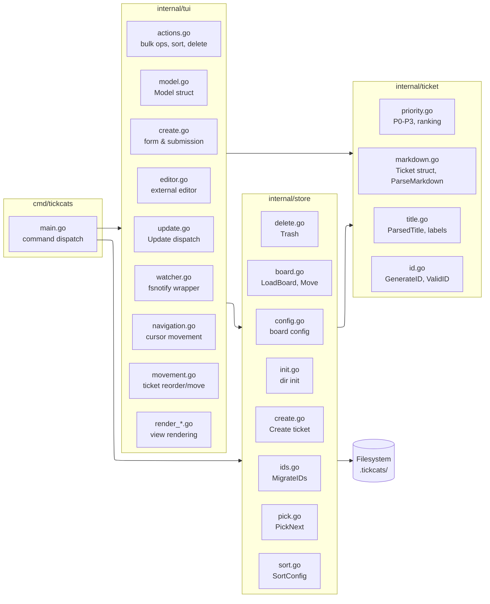
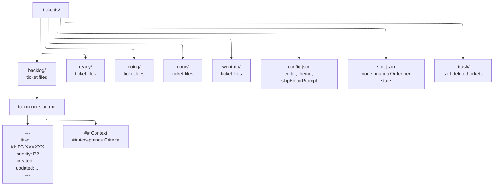
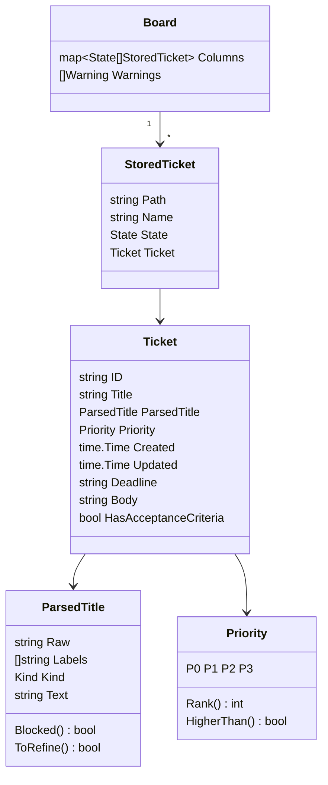
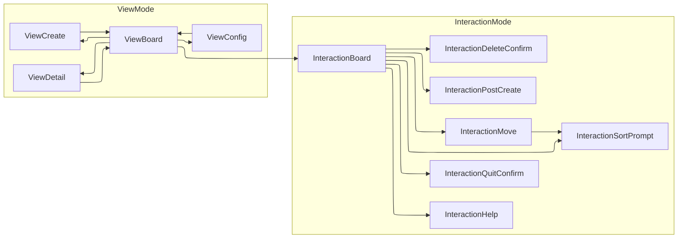

# System Architecture

Full module map, data flow, and file layout for the implemented TUI/CLI.

## Module dependency graph

```mermaid
%%{init: {"flowchart": {"defaultRenderer": "elk"}} }%%
graph LR
    subgraph CLI["cmd/tickcats"]
        Main["main.go\ncommand dispatch"]
    end

    subgraph TUI["internal/tui"]
        Model["model.go\nModel struct"]
        Update["update.go\nUpdate dispatch"]
        Actions["actions.go\nbulk ops, sort, delete"]
        Navigation["navigation.go\ncursor movement"]
        Movement["movement.go\nticket reorder/move"]
        Create["create.go\nform & submission"]
        Editor["editor.go\nexternal editor"]
        Watcher["watcher.go\nfsnotify wrapper"]
        Render["render_*.go\nview rendering"]
    end

    subgraph Store["internal/store"]
        Board["board.go\nLoadBoard, Move"]
        CreateStore["create.go\nCreate ticket"]
        Delete["delete.go\nTrash"]
        Pick["pick.go\nPickNext"]
        Sort["sort.go\nSortConfig"]
        Config["config.go\nboard config"]
        Init["init.go\ndir init"]
        IDs["ids.go\nMigrateIDs"]
    end

    subgraph Ticket["internal/ticket"]
        Markdown["markdown.go\nTicket struct, ParseMarkdown"]
        TitlePkg["title.go\nParsedTitle, labels"]
        PriorityPkg["priority.go\nP0-P3, ranking"]
        IDPkg["id.go\nGenerateID, ValidID"]
    end

    FS[("Filesystem\n.tickcats/")]

    Main --> Store
    Main --> TUI
    TUI --> Store
    TUI --> Ticket
    Store --> Ticket
    Store --> FS
```

## File system layout

```mermaid
%%{init: {"flowchart": {"defaultRenderer": "elk"}} }%%
flowchart TD
    Root[".tickcats/"]
    Root --> Backlog["backlog/\nticket files"]
    Root --> Ready["ready/\nticket files"]
    Root --> Doing["doing/\nticket files"]
    Root --> Done["done/\nticket files"]
    Root --> WontDo["wont-do/\nticket files"]
    Root --> Config["config.json\neditor, theme, skipEditorPrompt"]
    Root --> SortJSON["sort.json\nmode, manualOrder per state"]
    Root --> Trash[".trash/\nsoft-deleted tickets"]

    Backlog --> File["tc-xxxxxx-slug.md"]
    File --> FM["---\ntitle: ...\nid: TC-XXXXXX\npriority: P2\ncreated: ...\nupdated: ...\n---"]
    File --> Body["## Context\n## Acceptance Criteria"]
```

## Data model

```mermaid
classDiagram
    class Board {
        map~State[]StoredTicket~ Columns
        []Warning Warnings
    }
    class StoredTicket {
        string Path
        string Name
        State State
        Ticket Ticket
    }
    class Ticket {
        string ID
        string Title
        ParsedTitle ParsedTitle
        Priority Priority
        time.Time Created
        time.Time Updated
        string Deadline
        string Body
        bool HasAcceptanceCriteria
    }
    class ParsedTitle {
        string Raw
        []string Labels
        Kind Kind
        string Text
        Blocked() bool
        ToRefine() bool
    }
    class Priority {
        P0 P1 P2 P3
        Rank() int
        HigherThan() bool
    }
    Board "1" --> "*" StoredTicket
    StoredTicket --> Ticket
    Ticket --> ParsedTitle
    Ticket --> Priority
```

## TUI model state

```mermaid
%%{init: {"flowchart": {"defaultRenderer": "elk"}} }%%
graph LR
    subgraph ViewMode
        VB[ViewBoard]
        VD[ViewDetail]
        VC[ViewCreate]
        VCfg[ViewConfig]
    end

    subgraph InteractionMode
        IB[InteractionBoard]
        IM[InteractionMove]
        IDel[InteractionDeleteConfirm]
        IPC[InteractionPostCreate]
        ISP[InteractionSortPrompt]
        IQC[InteractionQuitConfirm]
        IH[InteractionHelp]
    end

    VB --> VD
    VB --> VC
    VB --> VCfg
    VD --> VB
    VC --> VB
    VCfg --> VB
    VB --> IB
    IB --> IM
    IB --> IDel
    IB --> IPC
    IB --> ISP
    IB --> IQC
    IB --> IH
    IM --> ISP
```
