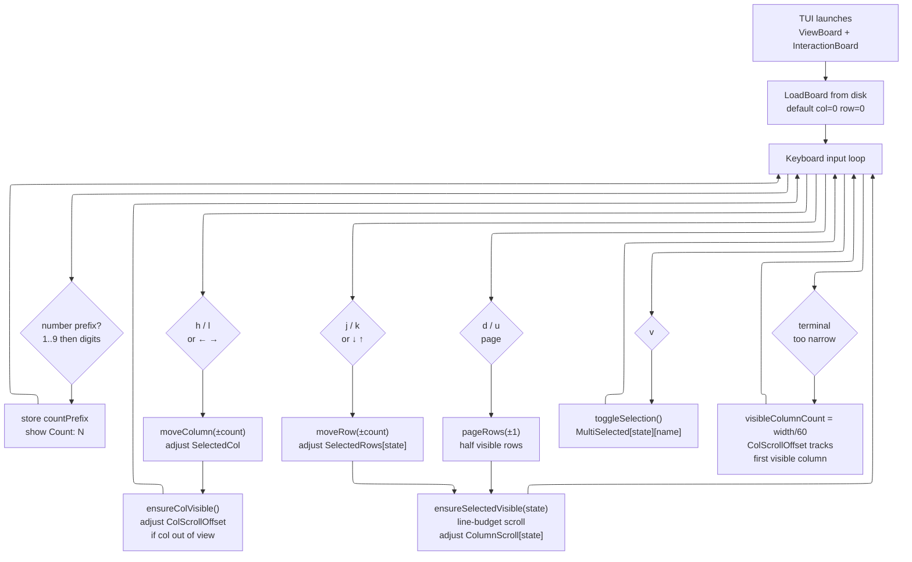
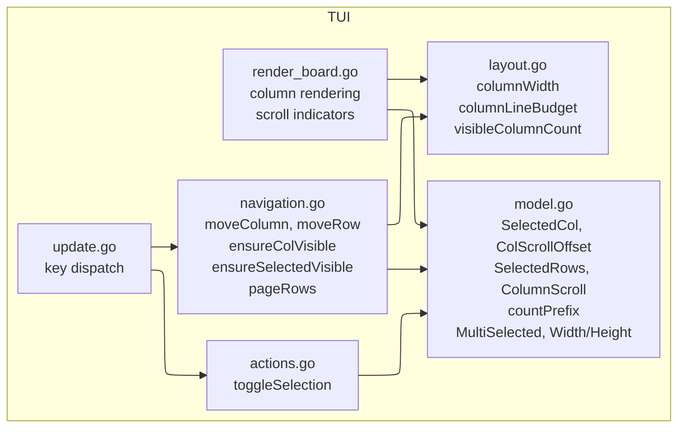
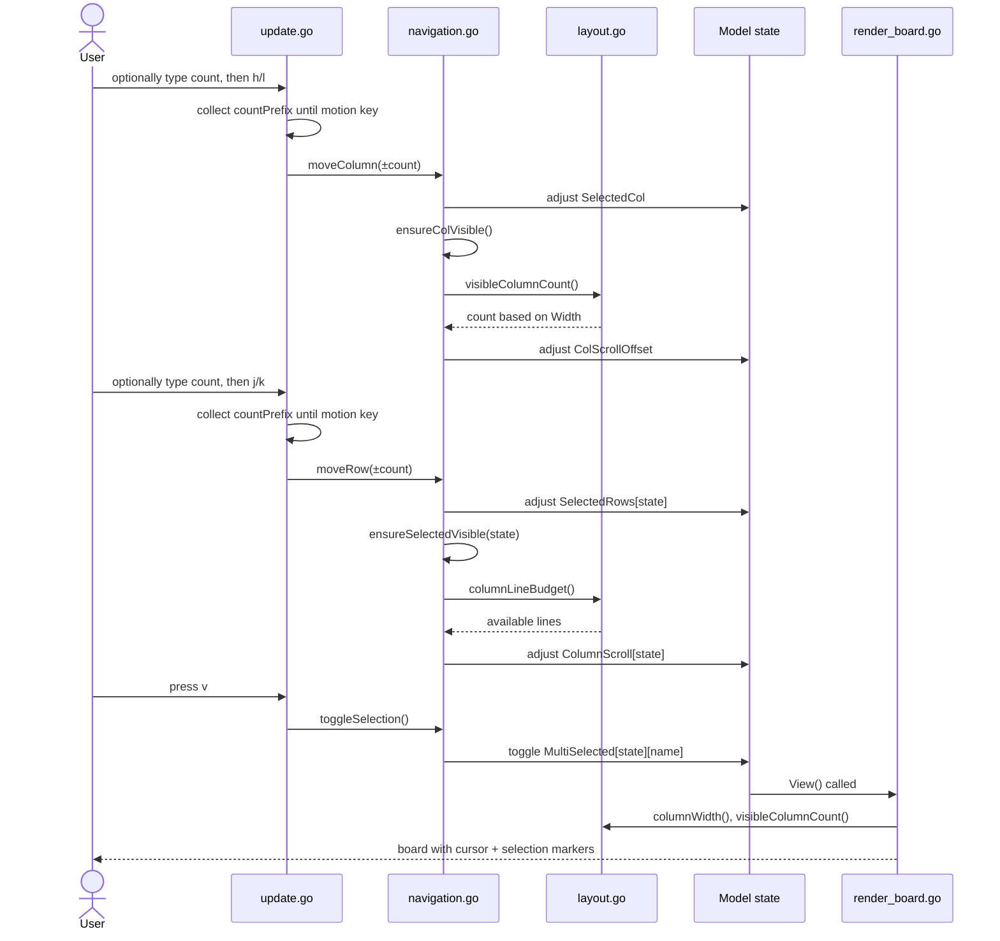

# Board Navigation

Column/row movement, vim-style count prefixes, multi-select, horizontal scroll, and vertical scroll within columns.

## User flow

## Module architecture

## Module integration sequence

