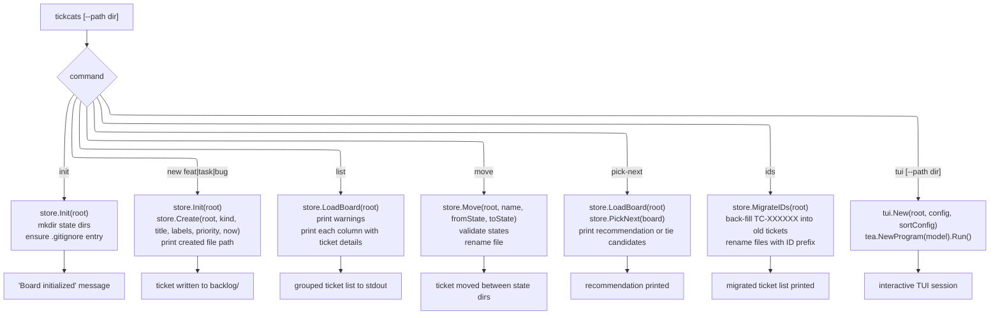
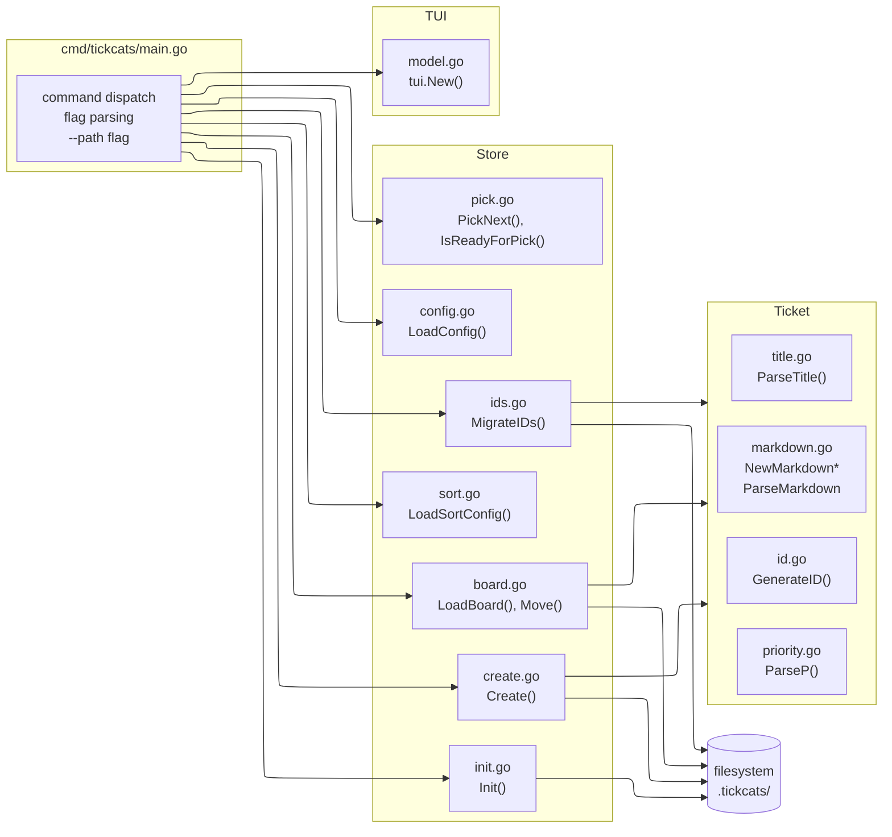
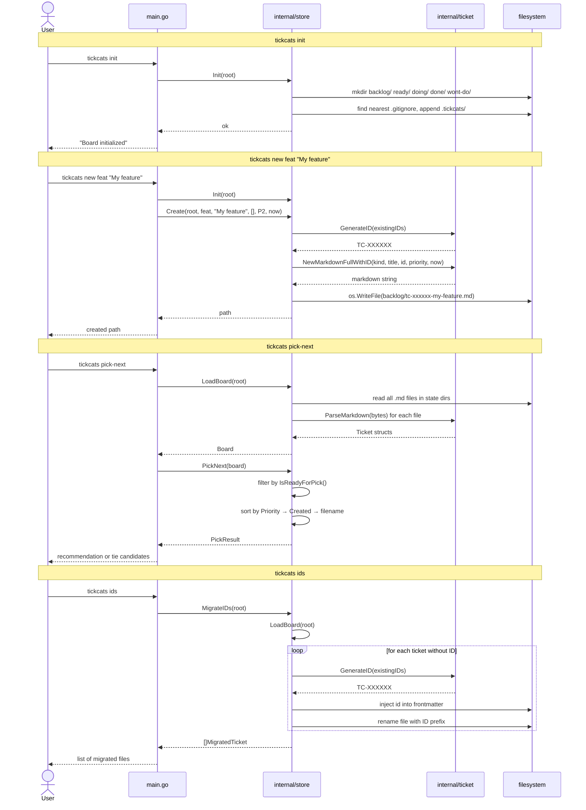

# CLI Commands

Non-TUI command-line operations: init, new, list, move, pick-next, ids, and tui.

## User flow

```mermaid
%%{init: {"flowchart": {"defaultRenderer": "elk"}} }%%
flowchart TD
    Start["tickcats [--path dir] <command>"] --> Dispatch{"command"}

    Dispatch -->|"init"| Init["store.Init(root)\nmkdir state dirs\nensure .gitignore entry"]
    Init --> InitDone["'Board initialized' message"]

    Dispatch -->|"new feat|task|bug <title> [flags]"| New["store.Init(root)\nstore.Create(root, kind, title, labels, priority, now)\nprint created file path"]
    New --> NewDone["ticket written to backlog/"]

    Dispatch -->|"list"| List["store.LoadBoard(root)\nprint warnings\nprint each column with ticket details"]
    List --> ListDone["grouped ticket list to stdout"]

    Dispatch -->|"move <name> <from> <to>"| Move["store.Move(root, name, fromState, toState)\nvalidate states\nrename file"]
    Move --> MoveDone["ticket moved between state dirs"]

    Dispatch -->|"pick-next"| PickNext["store.LoadBoard(root)\nstore.PickNext(board)\nprint recommendation or tie candidates"]
    PickNext --> PickDone["recommendation printed"]

    Dispatch -->|"ids"| IDs["store.MigrateIDs(root)\nback-fill TC-XXXXXX into old tickets\nrename files with ID prefix"]
    IDs --> IDsDone["migrated ticket list printed"]

    Dispatch -->|"tui [--path dir]"| TUI["tui.New(root, config, sortConfig)\ntea.NewProgram(model).Run()"]
    TUI --> TUIDone["interactive TUI session"]
```

## Module architecture

```mermaid
%%{init: {"flowchart": {"defaultRenderer": "elk"}} }%%
graph LR
    subgraph CLI["cmd/tickcats/main.go"]
        Main["command dispatch\nflag parsing\n--path flag"]
    end

    subgraph Store
        Init["init.go\nInit()"]
        Create["create.go\nCreate()"]
        Board["board.go\nLoadBoard(), Move()"]
        Pick["pick.go\nPickNext(), IsReadyForPick()"]
        IDs["ids.go\nMigrateIDs()"]
        Config["config.go\nLoadConfig()"]
        Sort["sort.go\nLoadSortConfig()"]
    end

    subgraph Ticket
        Markdown["markdown.go\nNewMarkdown*\nParseMarkdown"]
        IDPkg["id.go\nGenerateID()"]
        TitlePkg["title.go\nParseTitle()"]
        PriorityPkg["priority.go\nParseP()"]
    end

    subgraph TUI
        TUINew["model.go\ntui.New()"]
    end

    FS[("filesystem\n.tickcats/")]

    Main --> Init
    Main --> Create
    Main --> Board
    Main --> Pick
    Main --> IDs
    Main --> Config
    Main --> Sort
    Main --> TUINew
    Create --> Ticket
    IDs --> Ticket
    Board --> Ticket
    Init --> FS
    Create --> FS
    Board --> FS
    IDs --> FS
```

## Module integration sequence

```mermaid
sequenceDiagram
    actor User
    participant CLI as main.go
    participant Store as internal/store
    participant Ticket as internal/ticket
    participant FS as filesystem

    Note over User,FS: tickcats init
    User->>CLI: tickcats init
    CLI->>Store: Init(root)
    Store->>FS: mkdir backlog/ ready/ doing/ done/ wont-do/
    Store->>FS: find nearest .gitignore, append .tickcats/
    Store-->>CLI: ok
    CLI-->>User: "Board initialized"

    Note over User,FS: tickcats new feat "My feature"
    User->>CLI: tickcats new feat "My feature"
    CLI->>Store: Init(root)
    CLI->>Store: Create(root, feat, "My feature", [], P2, now)
    Store->>Ticket: GenerateID(existingIDs)
    Ticket-->>Store: TC-XXXXXX
    Store->>Ticket: NewMarkdownFullWithID(kind, title, id, priority, now)
    Ticket-->>Store: markdown string
    Store->>FS: os.WriteFile(backlog/tc-xxxxxx-my-feature.md)
    Store-->>CLI: path
    CLI-->>User: created path

    Note over User,FS: tickcats pick-next
    User->>CLI: tickcats pick-next
    CLI->>Store: LoadBoard(root)
    Store->>FS: read all .md files in state dirs
    Store->>Ticket: ParseMarkdown(bytes) for each file
    Ticket-->>Store: Ticket structs
    Store-->>CLI: Board
    CLI->>Store: PickNext(board)
    Store->>Store: filter by IsReadyForPick()
    Store->>Store: sort by Priority → Created → filename
    Store-->>CLI: PickResult
    CLI-->>User: recommendation or tie candidates

    Note over User,FS: tickcats ids
    User->>CLI: tickcats ids
    CLI->>Store: MigrateIDs(root)
    Store->>Store: LoadBoard(root)
    loop for each ticket without ID
        Store->>Ticket: GenerateID(existingIDs)
        Ticket-->>Store: TC-XXXXXX
        Store->>FS: inject id into frontmatter
        Store->>FS: rename file with ID prefix
    end
    Store-->>CLI: []MigratedTicket
    CLI-->>User: list of migrated files
```
