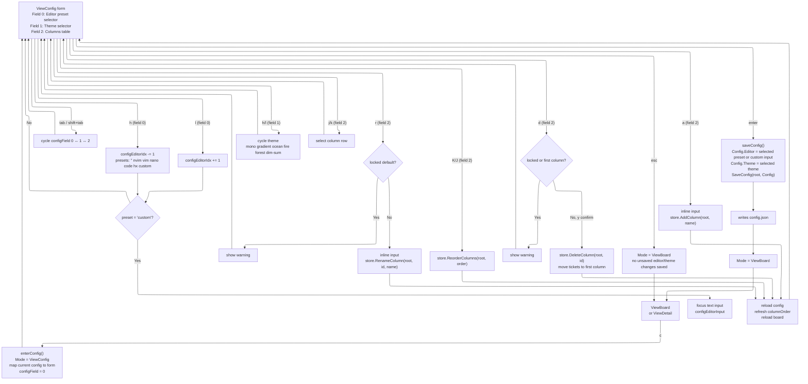
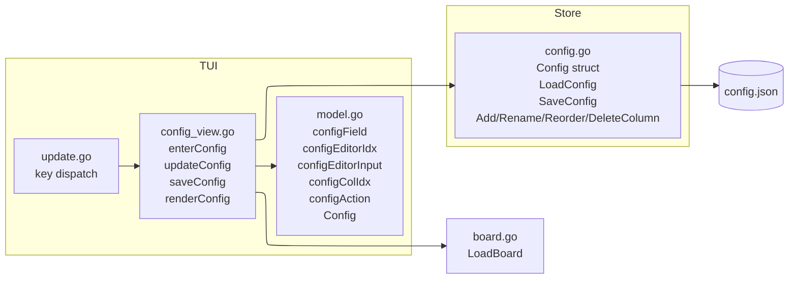
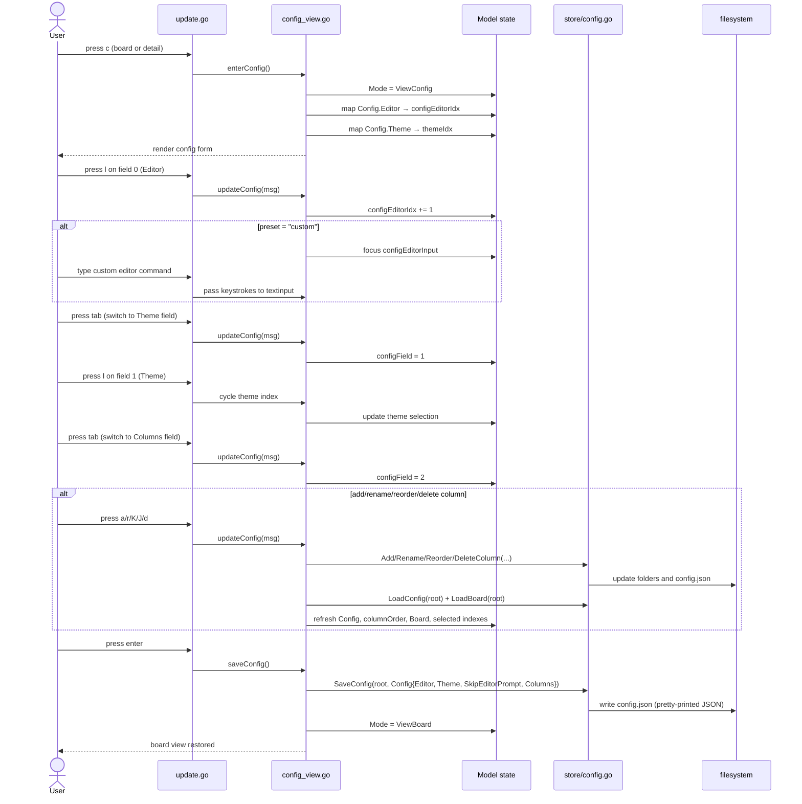

# Configuration

Edit editor command, color theme, and board columns through the TUI config form.

## User flow

```mermaid
%%{init: {"flowchart": {"defaultRenderer": "elk"}} }%%
flowchart TD
    Board["ViewBoard\nor ViewDetail"] -->|"c"| Enter["enterConfig()\nMode = ViewConfig\nmap current config to form\nconfigField = 0"]
    Enter --> Form["ViewConfig form\nField 0: Editor preset selector\nField 1: Theme selector\nField 2: Columns table"]

    Form -->|"tab / shift+tab"| CycleField["cycle configField 0 ↔ 1 ↔ 2"]
    CycleField --> Form

    Form -->|"h (field 0)"| PrevEditor["configEditorIdx -= 1\npresets: '' nvim vim nano code hx custom"]
    Form -->|"l (field 0)"| NextEditor["configEditorIdx += 1"]
    PrevEditor --> CheckCustom{"preset = 'custom'?"}
    NextEditor --> CheckCustom
    CheckCustom -->|Yes| FocusInput["focus text input\nconfigEditorInput"]
    CheckCustom -->|No| Form

    Form -->|"h/l (field 1)"| CycleTheme["cycle theme\nmono gradient ocean fire forest dim-sum"]
    CycleTheme --> Form

    Form -->|"j/k (field 2)"| SelectColumn["select column row"]
    SelectColumn --> Form

    Form -->|"a (field 2)"| AddColumn["inline input\nstore.AddColumn(root, name)"]
    AddColumn --> RefreshColumns["reload config\nrefresh columnOrder\nreload board"]
    RefreshColumns --> Form

    Form -->|"r (field 2)"| RenameColumn{"locked default?"}
    RenameColumn -->|Yes| BlockRename["show warning"]
    BlockRename --> Form
    RenameColumn -->|No| RenameStore["inline input\nstore.RenameColumn(root, id, name)"]
    RenameStore --> RefreshColumns

    Form -->|"K/J (field 2)"| ReorderColumn["store.ReorderColumns(root, order)"]
    ReorderColumn --> RefreshColumns

    Form -->|"d (field 2)"| DeleteColumn{"locked or first column?"}
    DeleteColumn -->|Yes| BlockDelete["show warning"]
    BlockDelete --> Form
    DeleteColumn -->|No, y confirm| DeleteStore["store.DeleteColumn(root, id)\nmove tickets to first column"]
    DeleteStore --> RefreshColumns

    Form -->|"esc"| Discard["Mode = ViewBoard\nno unsaved editor/theme changes saved"]
    Discard --> Board

    Form -->|"enter"| Save["saveConfig()\nConfig.Editor = selected preset or custom input\nConfig.Theme = selected theme\nSaveConfig(root, Config)"]
    Save --> WriteConfig["writes config.json"]
    WriteConfig --> Return["Mode = ViewBoard"]
    Return --> Board
```

## Module architecture

```mermaid
%%{init: {"flowchart": {"defaultRenderer": "elk"}} }%%
graph LR
    subgraph TUI
        Update["update.go\nkey dispatch"]
        ConfigView["config_view.go\nenterConfig\nupdateConfig\nsaveConfig\nrenderConfig"]
        Model["model.go\nconfigField\nconfigEditorIdx\nconfigEditorInput\nconfigColIdx\nconfigAction\nConfig"]
    end

    subgraph Store
        Config["config.go\nConfig struct\nLoadConfig\nSaveConfig\nAdd/Rename/Reorder/DeleteColumn"]
    end

    FS[("config.json")]

    Update --> ConfigView
    ConfigView --> Config
    ConfigView --> Model
    Config --> FS
    ConfigView --> BoardStore["board.go\nLoadBoard"]
```

## Module integration sequence

```mermaid
sequenceDiagram
    actor User
    participant Update as update.go
    participant ConfigView as config_view.go
    participant Model as Model state
    participant Store as store/config.go
    participant FS as filesystem

    User->>Update: press c (board or detail)
    Update->>ConfigView: enterConfig()
    ConfigView->>Model: Mode = ViewConfig
    ConfigView->>Model: map Config.Editor → configEditorIdx
    ConfigView->>Model: map Config.Theme → themeIdx
    ConfigView-->>User: render config form

    User->>Update: press l on field 0 (Editor)
    Update->>ConfigView: updateConfig(msg)
    ConfigView->>Model: configEditorIdx += 1

    alt preset = "custom"
        ConfigView->>Model: focus configEditorInput
        User->>Update: type custom editor command
        Update->>ConfigView: pass keystrokes to textinput
    end

    User->>Update: press tab (switch to Theme field)
    Update->>ConfigView: updateConfig(msg)
    ConfigView->>Model: configField = 1

    User->>Update: press l on field 1 (Theme)
    Update->>ConfigView: cycle theme index
    ConfigView->>Model: update theme selection

    User->>Update: press tab (switch to Columns field)
    Update->>ConfigView: updateConfig(msg)
    ConfigView->>Model: configField = 2

    alt add/rename/reorder/delete column
        User->>Update: press a/r/K/J/d
        Update->>ConfigView: updateConfig(msg)
        ConfigView->>Store: Add/Rename/Reorder/DeleteColumn(...)
        Store->>FS: update folders and config.json
        ConfigView->>Store: LoadConfig(root) + LoadBoard(root)
        ConfigView->>Model: refresh Config, columnOrder, Board, selected indexes
    end

    User->>Update: press enter
    Update->>ConfigView: saveConfig()
    ConfigView->>Store: SaveConfig(root, Config{Editor, Theme, SkipEditorPrompt, Columns})
    Store->>FS: write config.json (pretty-printed JSON)
    ConfigView->>Model: Mode = ViewBoard
    ConfigView-->>User: board view restored
```
