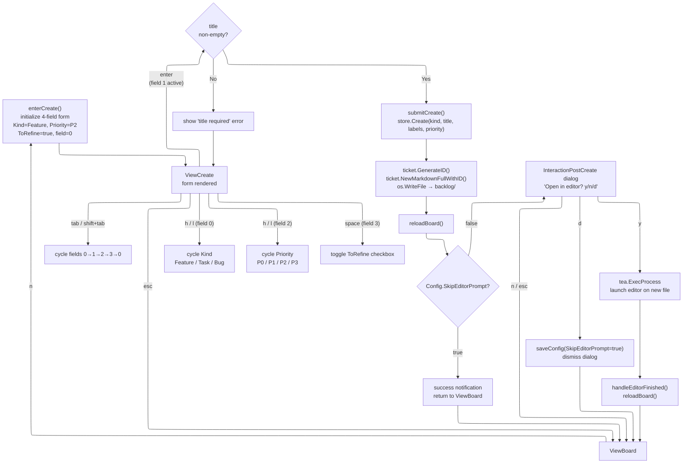
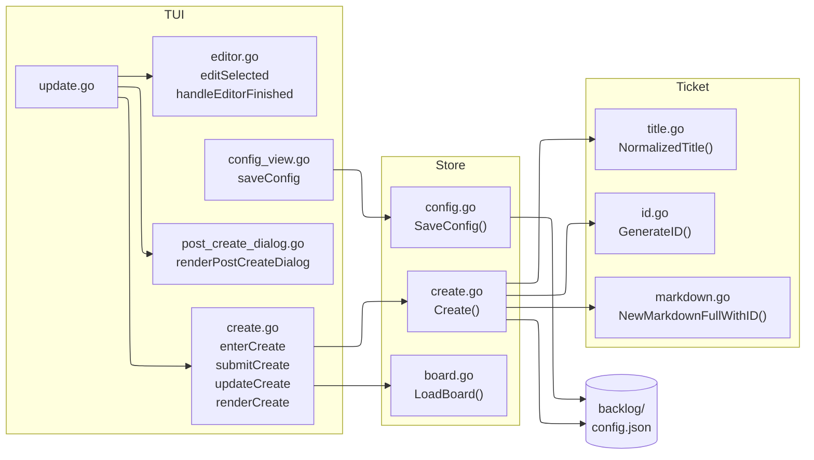

# Create Ticket

Form-based ticket creation with optional external editor launch on completion.

## User flow



## Module architecture



## Module integration sequence

```mermaid
sequenceDiagram
    actor User
    participant Update as update.go
    participant Create as create.go
    participant StoreCreate as store/create.go
    participant Ticket as internal/ticket
    participant FS as filesystem
    participant Editor as external editor

    User->>Update: press n (on board)
    Update->>Create: enterCreate()
    Create-->>User: render 4-field form

    User->>Update: fill fields + press enter
    Update->>Create: submitCreate()
    Create->>StoreCreate: Create(root, kind, title, labels, priority, now)
    StoreCreate->>Ticket: GenerateID(existingIDs)
    Ticket-->>StoreCreate: TC-XXXXXX
    StoreCreate->>Ticket: NewMarkdownFullWithID(...)
    Ticket-->>StoreCreate: markdown content
    StoreCreate->>FS: os.WriteFile(backlog/tc-xxxxxx-slug.md)
    StoreCreate-->>Create: path

    Create->>StoreCreate: LoadBoard(root)
    StoreCreate-->>Create: Board

    alt SkipEditorPrompt = false
        Create-->>User: render post-create dialog
        User->>Update: press y
        Update->>Editor: tea.ExecProcess(editor, path)
        Editor-->>Update: process exits
        Update->>Create: handleEditorFinished()
        Create->>StoreCreate: LoadBoard(root)
    else SkipEditorPrompt = true
        Create-->>User: success notification + board
    end
```
