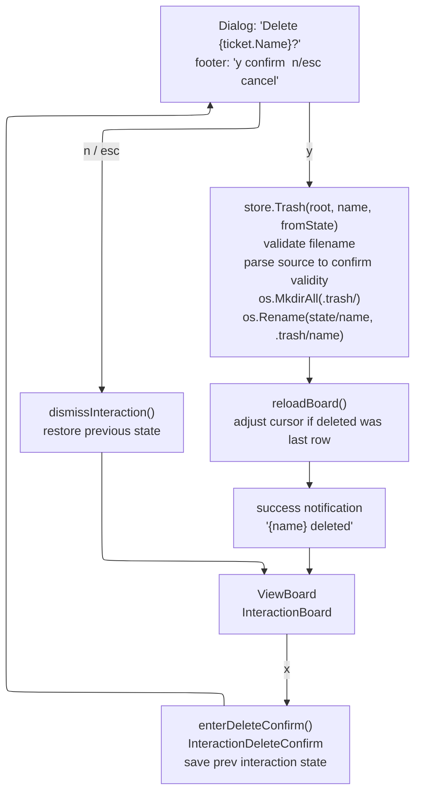
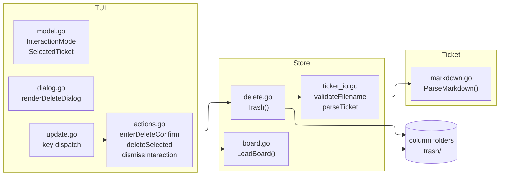
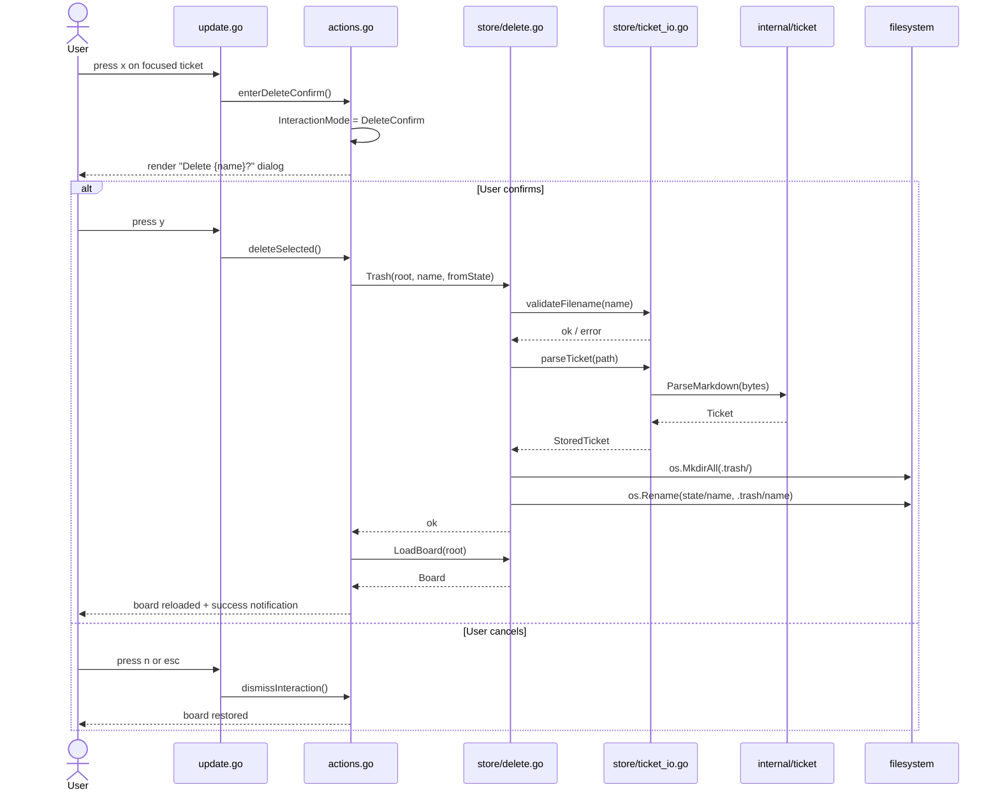

# Delete Ticket

Soft-delete flow: confirm dialog → move file to `.trash/`.

## User flow

```mermaid
%%{init: {"flowchart": {"defaultRenderer": "elk"}} }%%
flowchart TD
    Board["ViewBoard\nInteractionBoard"] -->|"x"| EnterDel["enterDeleteConfirm()\nInteractionDeleteConfirm\nsave prev interaction state"]
    EnterDel --> Dialog["Dialog: 'Delete {ticket.Name}?'\nfooter: 'y confirm  n/esc cancel'"]

    Dialog -->|"n / esc"| Dismiss["dismissInteraction()\nrestore previous state"]
    Dismiss --> Board

    Dialog -->|"y"| Trash["store.Trash(root, name, fromState)\nvalidate filename\nparse source to confirm validity\nos.MkdirAll(.trash/)\nos.Rename(state/name, .trash/name)"]
    Trash --> Reload["reloadBoard()\nadjust cursor if deleted was last row"]
    Reload --> Notify["success notification\n'{name} deleted'"]
    Notify --> Board
```

## Module architecture

```mermaid
%%{init: {"flowchart": {"defaultRenderer": "elk"}} }%%
graph LR
    subgraph TUI
        Update["update.go\nkey dispatch"]
        Actions["actions.go\nenterDeleteConfirm\ndeleteSelected\ndismissInteraction"]
        Dialog["dialog.go\nrenderDeleteDialog"]
        Model["model.go\nInteractionMode\nSelectedTicket"]
    end

    subgraph Store
        Delete["delete.go\nTrash()"]
        Board["board.go\nLoadBoard()"]
        TicketIO["ticket_io.go\nvalidateFilename\nparseTicket"]
    end

    subgraph Ticket
        Markdown["markdown.go\nParseMarkdown()"]
    end

    FS[("column folders\n.trash/")]

    Update --> Actions
    Actions --> Delete
    Actions --> Board
    Delete --> TicketIO
    TicketIO --> Markdown
    Delete --> FS
    Board --> FS
```

## Module integration sequence

```mermaid
sequenceDiagram
    actor User
    participant Update as update.go
    participant Actions as actions.go
    participant Store as store/delete.go
    participant TicketIO as store/ticket_io.go
    participant Ticket as internal/ticket
    participant FS as filesystem

    User->>Update: press x on focused ticket
    Update->>Actions: enterDeleteConfirm()
    Actions->>Actions: InteractionMode = DeleteConfirm
    Actions-->>User: render "Delete {name}?" dialog

    alt User confirms
        User->>Update: press y
        Update->>Actions: deleteSelected()
        Actions->>Store: Trash(root, name, fromState)
        Store->>TicketIO: validateFilename(name)
        TicketIO-->>Store: ok / error
        Store->>TicketIO: parseTicket(path)
        TicketIO->>Ticket: ParseMarkdown(bytes)
        Ticket-->>TicketIO: Ticket
        TicketIO-->>Store: StoredTicket
        Store->>FS: os.MkdirAll(.trash/)
        Store->>FS: os.Rename(state/name, .trash/name)
        Store-->>Actions: ok
        Actions->>Store: LoadBoard(root)
        Store-->>Actions: Board
        Actions-->>User: board reloaded + success notification
    else User cancels
        User->>Update: press n or esc
        Update->>Actions: dismissInteraction()
        Actions-->>User: board restored
    end
```
