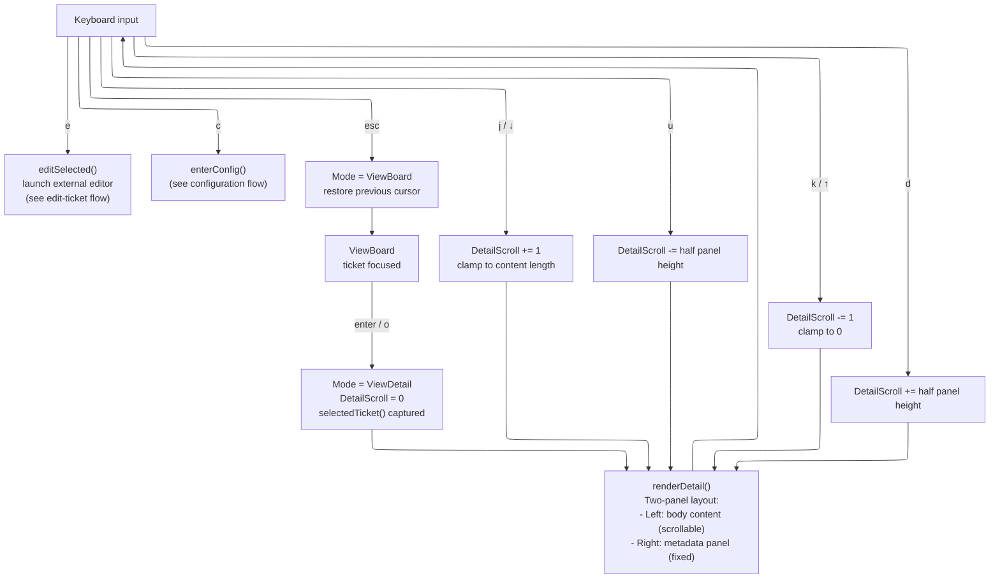
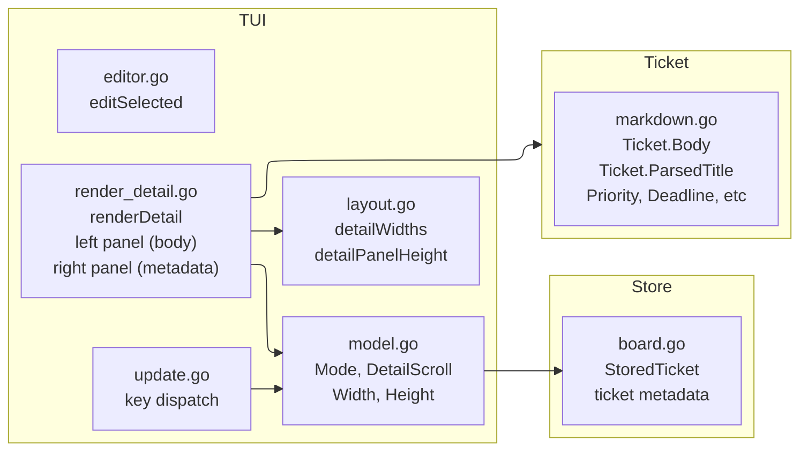
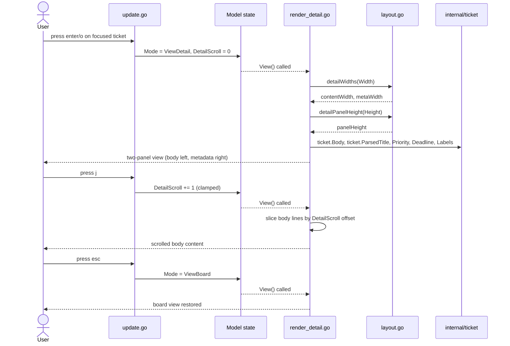

# Detail View

Open a ticket's full content in a two-panel layout with scrollable body and metadata.

## User flow

```mermaid
%%{init: {"flowchart": {"defaultRenderer": "elk"}} }%%
flowchart TD
    Board["ViewBoard\nticket focused"] -->|"enter / o"| OpenDetail["Mode = ViewDetail\nDetailScroll = 0\nselectedTicket() captured"]
    OpenDetail --> Render["renderDetail()\nTwo-panel layout:\n- Left: body content (scrollable)\n- Right: metadata panel (fixed)"]

    Render --> Loop["Keyboard input"]

    Loop -->|"j / ↓"| ScrollDown["DetailScroll += 1\nclamp to content length"]
    ScrollDown --> Render

    Loop -->|"k / ↑"| ScrollUp["DetailScroll -= 1\nclamp to 0"]
    ScrollUp --> Render

    Loop -->|"d"| PageDown["DetailScroll += half panel height"]
    PageDown --> Render

    Loop -->|"u"| PageUp["DetailScroll -= half panel height"]
    PageUp --> Render

    Loop -->|"e"| Edit["editSelected()\nlaunch external editor\n(see edit-ticket flow)"]

    Loop -->|"c"| Config["enterConfig()\n(see configuration flow)"]

    Loop -->|"esc"| Back["Mode = ViewBoard\nrestore previous cursor"]
    Back --> Board
```

## Module architecture

```mermaid
%%{init: {"flowchart": {"defaultRenderer": "elk"}} }%%
graph LR
    subgraph TUI
        Update["update.go\nkey dispatch"]
        RenderDetail["render_detail.go\nrenderDetail\nleft panel (body)\nright panel (metadata)"]
        Layout["layout.go\ndetailWidths\ndetailPanelHeight"]
        Model["model.go\nMode, DetailScroll\nWidth, Height"]
        Editor["editor.go\neditSelected"]
    end

    subgraph Store
        Board["board.go\nStoredTicket\nticket metadata"]
    end

    subgraph Ticket
        Markdown["markdown.go\nTicket.Body\nTicket.ParsedTitle\nPriority, Deadline, etc"]
    end

    Update --> Model
    RenderDetail --> Layout
    RenderDetail --> Model
    RenderDetail --> Ticket
    Model --> Board
```

## Module integration sequence

```mermaid
sequenceDiagram
    actor User
    participant Update as update.go
    participant Model as Model state
    participant Render as render_detail.go
    participant Layout as layout.go
    participant Ticket as internal/ticket

    User->>Update: press enter/o on focused ticket
    Update->>Model: Mode = ViewDetail, DetailScroll = 0
    Model-->>Render: View() called
    Render->>Layout: detailWidths(Width)
    Layout-->>Render: contentWidth, metaWidth
    Render->>Layout: detailPanelHeight(Height)
    Layout-->>Render: panelHeight
    Render->>Ticket: ticket.Body, ticket.ParsedTitle, Priority, Deadline, Labels
    Render-->>User: two-panel view (body left, metadata right)

    User->>Update: press j
    Update->>Model: DetailScroll += 1 (clamped)
    Model-->>Render: View() called
    Render->>Render: slice body lines by DetailScroll offset
    Render-->>User: scrolled body content

    User->>Update: press esc
    Update->>Model: Mode = ViewBoard
    Model-->>Render: View() called
    Render-->>User: board view restored
```
