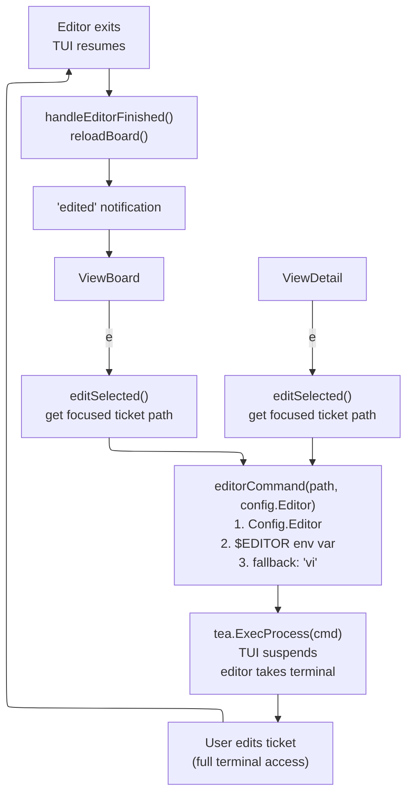
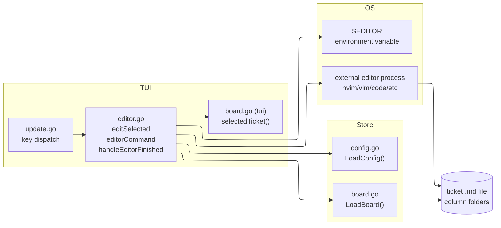
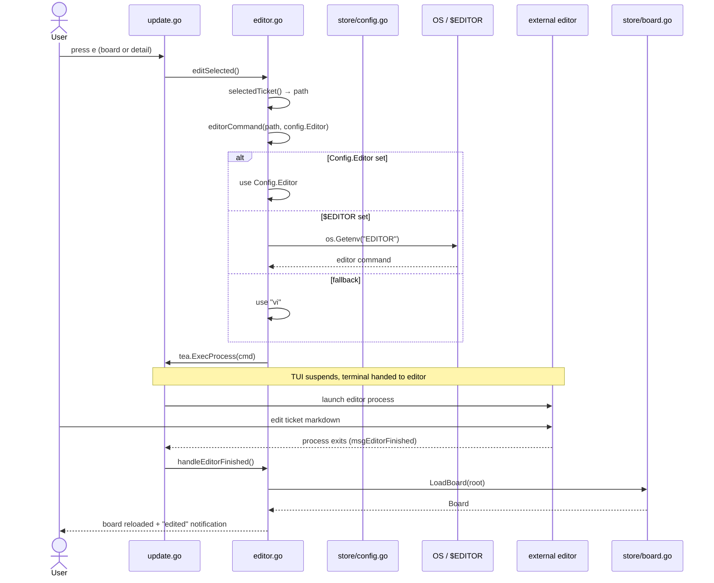

# Edit Ticket

Launch external editor on a ticket file from board or detail view.

## User flow

```mermaid
%%{init: {"flowchart": {"defaultRenderer": "elk"}} }%%
flowchart TD
    Board["ViewBoard"] -->|"e"| EditBoard["editSelected()\nget focused ticket path"]
    Detail["ViewDetail"] -->|"e"| EditDetail["editSelected()\nget focused ticket path"]

    EditBoard --> ResolveEditor["editorCommand(path, config.Editor)\n1. Config.Editor\n2. $EDITOR env var\n3. fallback: 'vi'"]
    EditDetail --> ResolveEditor

    ResolveEditor --> LaunchEditor["tea.ExecProcess(cmd)\nTUI suspends\neditor takes terminal"]
    LaunchEditor --> EditorRunning["User edits ticket\n(full terminal access)"]
    EditorRunning --> EditorExit["Editor exits\nTUI resumes"]
    EditorExit --> HandleFinish["handleEditorFinished()\nreloadBoard()"]
    HandleFinish --> Notify["'edited' notification"]
    Notify --> Board
```

## Module architecture

```mermaid
%%{init: {"flowchart": {"defaultRenderer": "elk"}} }%%
graph LR
    subgraph TUI
        Update["update.go\nkey dispatch"]
        Editor["editor.go\neditSelected\neditorCommand\nhandleEditorFinished"]
        Board["board.go (tui)\nselectedTicket()"]
    end

    subgraph Store
        BoardStore["board.go\nLoadBoard()"]
        Config["config.go\nLoadConfig()"]
    end

    subgraph OS
        EnvEditor["$EDITOR\nenvironment variable"]
        ExternalEditor["external editor process\nnvim/vim/code/etc"]
    end

    FS[("ticket .md file\ncolumn folders")]

    Update --> Editor
    Editor --> Board
    Editor --> Config
    Editor --> EnvEditor
    Editor --> ExternalEditor
    Editor --> BoardStore
    BoardStore --> FS
    ExternalEditor --> FS
```

## Module integration sequence

```mermaid
sequenceDiagram
    actor User
    participant Update as update.go
    participant Editor as editor.go
    participant Config as store/config.go
    participant OS as OS / $EDITOR
    participant ExtEditor as external editor
    participant Store as store/board.go

    User->>Update: press e (board or detail)
    Update->>Editor: editSelected()
    Editor->>Editor: selectedTicket() → path
    Editor->>Editor: editorCommand(path, config.Editor)

    alt Config.Editor set
        Editor->>Editor: use Config.Editor
    else $EDITOR set
        Editor->>OS: os.Getenv("EDITOR")
        OS-->>Editor: editor command
    else fallback
        Editor->>Editor: use "vi"
    end

    Editor->>Update: tea.ExecProcess(cmd)
    Note over Update,ExtEditor: TUI suspends, terminal handed to editor
    Update->>ExtEditor: launch editor process
    User->>ExtEditor: edit ticket markdown
    ExtEditor-->>Update: process exits (msgEditorFinished)

    Update->>Editor: handleEditorFinished()
    Editor->>Store: LoadBoard(root)
    Store-->>Editor: Board
    Editor-->>User: board reloaded + "edited" notification
```
