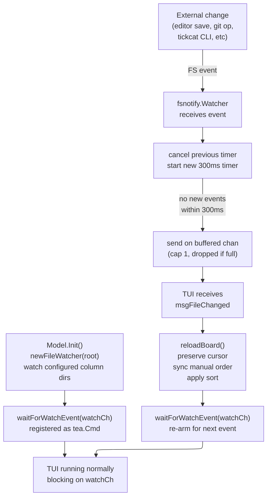
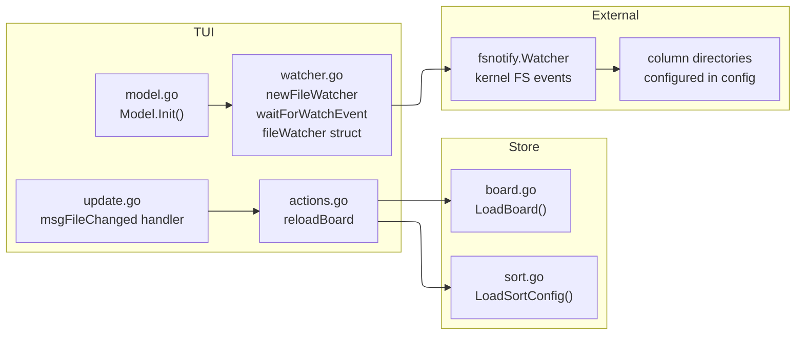
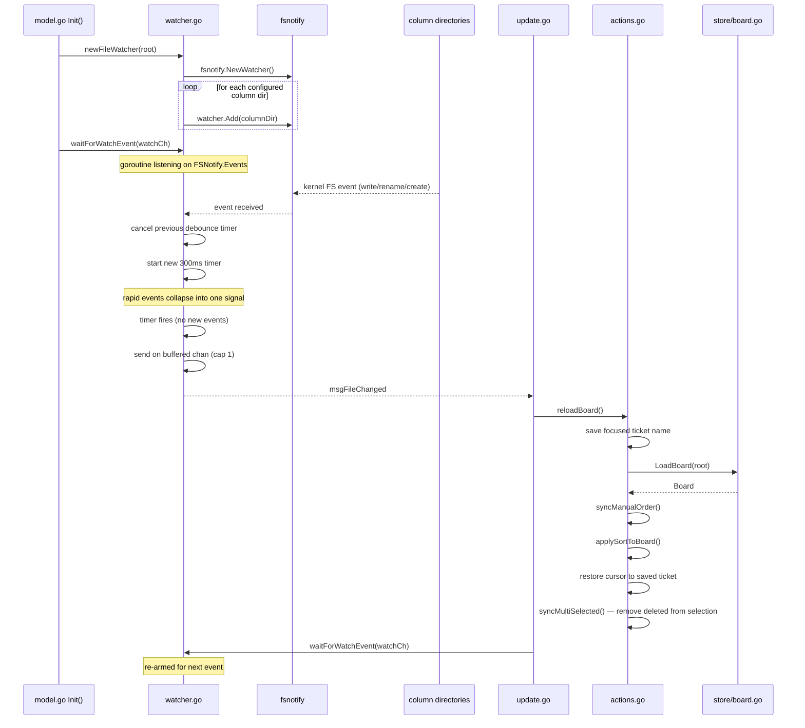

# File Watching

Automatic board reload when ticket files are changed externally (editor, CLI, git checkout, etc).

## User flow

```mermaid
%%{init: {"flowchart": {"defaultRenderer": "elk"}} }%%
flowchart TD
    Init["Model.Init()\nnewFileWatcher(root)\nwatch configured column dirs"]
    Init --> Arm["waitForWatchEvent(watchCh)\nregistered as tea.Cmd"]
    Arm --> Waiting["TUI running normally\nblocking on watchCh"]

    FS["External change\n(editor save, git op,\ntickcat CLI, etc)"] -->|"FS event"| Watcher["fsnotify.Watcher\nreceives event"]
    Watcher --> Debounce["cancel previous timer\nstart new 300ms timer"]
    Debounce -->|"no new events\nwithin 300ms"| Signal["send on buffered chan\n(cap 1, dropped if full)"]
    Signal --> MsgReceived["TUI receives\nmsgFileChanged"]
    MsgReceived --> Reload["reloadBoard()\npreserve cursor\nsync manual order\napply sort"]
    Reload --> ReArm["waitForWatchEvent(watchCh)\nre-arm for next event"]
    ReArm --> Waiting
```

## Module architecture

```mermaid
%%{init: {"flowchart": {"defaultRenderer": "elk"}} }%%
graph LR
    subgraph TUI
        Init["model.go\nModel.Init()"]
        Update["update.go\nmsgFileChanged handler"]
        Watcher["watcher.go\nnewFileWatcher\nwaitForWatchEvent\nfileWatcher struct"]
        Actions["actions.go\nreloadBoard"]
    end

    subgraph Store
        Board["board.go\nLoadBoard()"]
        Sort["sort.go\nLoadSortConfig()"]
    end

    subgraph External["External"]
        FSNotify["fsnotify.Watcher\nkernel FS events"]
        StateDirs["column directories\nconfigured in config"]
    end

    Init --> Watcher
    Watcher --> FSNotify
    FSNotify --> StateDirs
    Update --> Actions
    Actions --> Board
    Actions --> Sort
```

## Module integration sequence

```mermaid
sequenceDiagram
    participant Init as model.go Init()
    participant Watcher as watcher.go
    participant FSNotify as fsnotify
    participant FS as column directories
    participant Update as update.go
    participant Actions as actions.go
    participant Store as store/board.go

    Init->>Watcher: newFileWatcher(root)
    Watcher->>FSNotify: fsnotify.NewWatcher()
    loop for each configured column dir
        Watcher->>FSNotify: watcher.Add(columnDir)
    end
    Init->>Watcher: waitForWatchEvent(watchCh)
    Note over Watcher: goroutine listening on FSNotify.Events

    FS-->>FSNotify: kernel FS event (write/rename/create)
    FSNotify-->>Watcher: event received
    Watcher->>Watcher: cancel previous debounce timer
    Watcher->>Watcher: start new 300ms timer
    Note over Watcher: rapid events collapse into one signal

    Watcher->>Watcher: timer fires (no new events)
    Watcher->>Watcher: send on buffered chan (cap 1)
    Watcher-->>Update: msgFileChanged

    Update->>Actions: reloadBoard()
    Actions->>Actions: save focused ticket name
    Actions->>Store: LoadBoard(root)
    Store-->>Actions: Board
    Actions->>Actions: syncManualOrder()
    Actions->>Actions: applySortToBoard()
    Actions->>Actions: restore cursor to saved ticket
    Actions->>Actions: syncMultiSelected() — remove deleted from selection

    Update->>Watcher: waitForWatchEvent(watchCh)
    Note over Watcher: re-armed for next event
```
