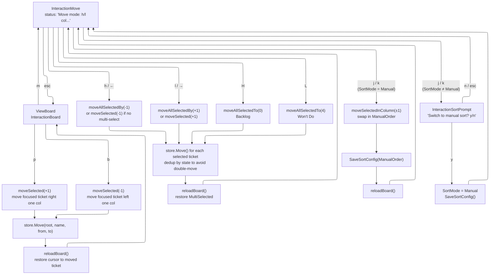
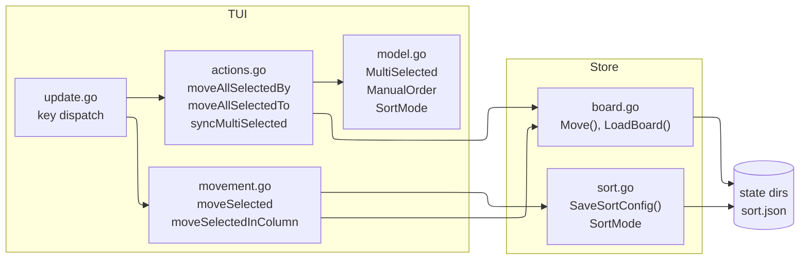
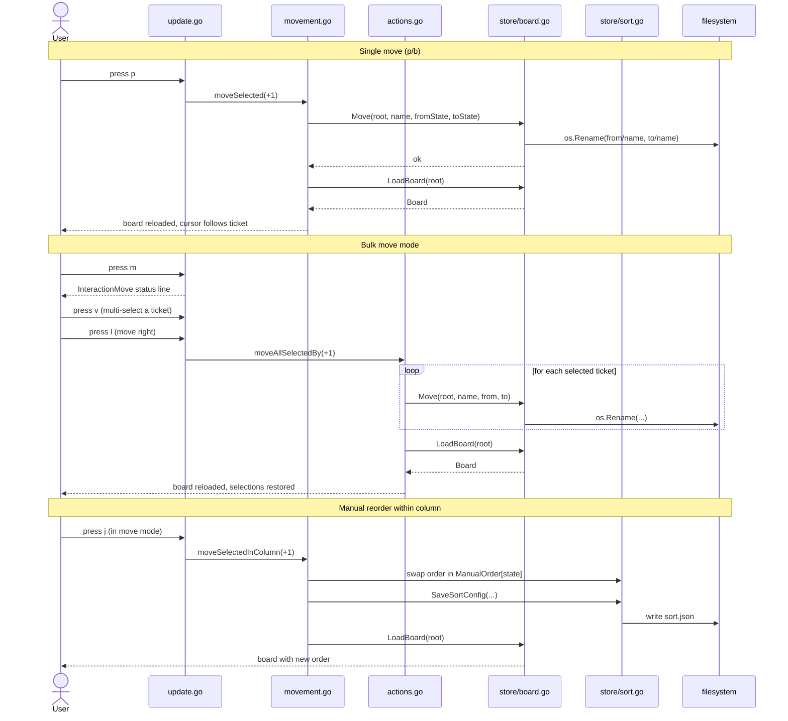

# Move Ticket

Single-ticket column movement, bulk move mode, and manual reordering within a column.

## User flow

```mermaid
%%{init: {"flowchart": {"defaultRenderer": "elk"}} }%%
flowchart TD
    Board["ViewBoard\nInteractionBoard"] -->|"p"| QuickRight["moveSelected(+1)\nmove focused ticket right one col"]
    Board -->|"b"| QuickLeft["moveSelected(-1)\nmove focused ticket left one col"]
    QuickRight --> StoreMove["store.Move(root, name, from, to)"]
    QuickLeft --> StoreMove
    StoreMove --> Reload["reloadBoard()\nrestore cursor to moved ticket"]
    Reload --> Board

    Board -->|"m"| MoveMode["InteractionMove\nstatus: 'Move mode: h/l col...'"]

    MoveMode -->|"esc"| Board
    MoveMode -->|"h / ←"| BulkLeft["moveAllSelectedBy(-1)\nor moveSelected(-1) if no multi-select"]
    MoveMode -->|"l / →"| BulkRight["moveAllSelectedBy(+1)\nor moveSelected(+1)"]
    MoveMode -->|"H"| BulkFirst["moveAllSelectedTo(0)\nBacklog"]
    MoveMode -->|"L"| BulkLast["moveAllSelectedTo(4)\nWon't Do"]

    BulkLeft --> BulkStore["store.Move() for each selected ticket\ndedup by state to avoid double-move"]
    BulkRight --> BulkStore
    BulkFirst --> BulkStore
    BulkLast --> BulkStore
    BulkStore --> BulkReload["reloadBoard()\nrestore MultiSelected"]
    BulkReload --> MoveMode

    MoveMode -->|"j / k\n(SortMode = Manual)"| Reorder["moveSelectedInColumn(±1)\nswap in ManualOrder"]
    Reorder --> SaveSort["SaveSortConfig(ManualOrder)"]
    SaveSort --> Reload2["reloadBoard()"]
    Reload2 --> MoveMode

    MoveMode -->|"j / k\n(SortMode ≠ Manual)"| SortPrompt["InteractionSortPrompt\n'Switch to manual sort? y/n'"]
    SortPrompt -->|"n / esc"| MoveMode
    SortPrompt -->|"y"| SwitchManual["SortMode = Manual\nSaveSortConfig()"]
    SwitchManual --> MoveMode
```

## Module architecture

```mermaid
%%{init: {"flowchart": {"defaultRenderer": "elk"}} }%%
graph LR
    subgraph TUI
        Update["update.go\nkey dispatch"]
        Actions["actions.go\nmoveAllSelectedBy\nmoveAllSelectedTo\nsyncMultiSelected"]
        Movement["movement.go\nmoveSelected\nmoveSelectedInColumn"]
        Model["model.go\nMultiSelected\nManualOrder\nSortMode"]
    end

    subgraph Store
        Board["board.go\nMove(), LoadBoard()"]
        Sort["sort.go\nSaveSortConfig()\nSortMode"]
    end

    FS[("state dirs\nsort.json")]

    Update --> Actions
    Update --> Movement
    Actions --> Board
    Actions --> Model
    Movement --> Board
    Movement --> Sort
    Sort --> FS
    Board --> FS
```

## Module integration sequence

```mermaid
sequenceDiagram
    actor User
    participant Update as update.go
    participant Movement as movement.go
    participant Actions as actions.go
    participant Store as store/board.go
    participant Sort as store/sort.go
    participant FS as filesystem

    Note over User,FS: Single move (p/b)
    User->>Update: press p
    Update->>Movement: moveSelected(+1)
    Movement->>Store: Move(root, name, fromState, toState)
    Store->>FS: os.Rename(from/name, to/name)
    Store-->>Movement: ok
    Movement->>Store: LoadBoard(root)
    Store-->>Movement: Board
    Movement-->>User: board reloaded, cursor follows ticket

    Note over User,FS: Bulk move mode
    User->>Update: press m
    Update-->>User: InteractionMove status line

    User->>Update: press v (multi-select a ticket)
    User->>Update: press l (move right)
    Update->>Actions: moveAllSelectedBy(+1)
    loop for each selected ticket
        Actions->>Store: Move(root, name, from, to)
        Store->>FS: os.Rename(...)
    end
    Actions->>Store: LoadBoard(root)
    Store-->>Actions: Board
    Actions-->>User: board reloaded, selections restored

    Note over User,FS: Manual reorder within column
    User->>Update: press j (in move mode)
    Update->>Movement: moveSelectedInColumn(+1)
    Movement->>Sort: swap order in ManualOrder[state]
    Movement->>Sort: SaveSortConfig(...)
    Sort->>FS: write sort.json
    Movement->>Store: LoadBoard(root)
    Store-->>User: board with new order
```
