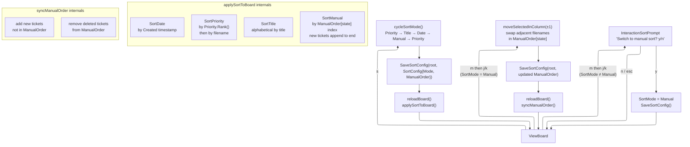
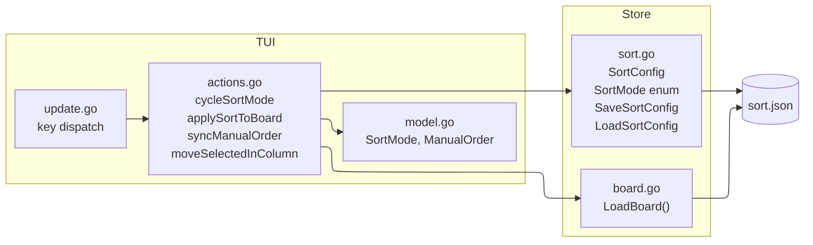
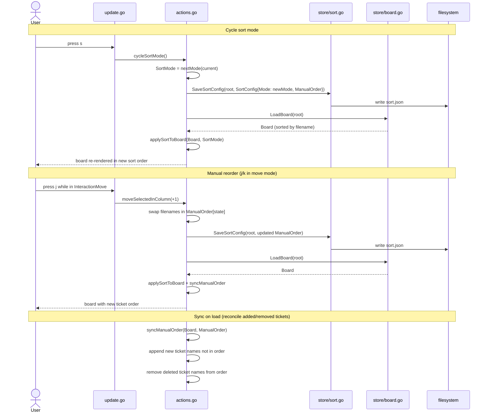

# Sort Management

Cycle sort modes, persist to disk, and manage manual ordering within columns.

## User flow

```mermaid
%%{init: {"flowchart": {"defaultRenderer": "elk"}} }%%
flowchart TD
    Board["ViewBoard"] -->|"s"| Cycle["cycleSortMode()\nPriority → Title → Date → Manual → Priority"]
    Cycle --> Save["SaveSortConfig(root, SortConfig{Mode, ManualOrder})"]
    Save --> Reload["reloadBoard()\napplySortToBoard()"]
    Reload --> Board

    Board -->|"m then j/k\n(SortMode = Manual)"| ManualReorder["moveSelectedInColumn(±1)\nswap adjacent filenames\nin ManualOrder[state]"]
    ManualReorder --> SaveManual["SaveSortConfig(root, updated ManualOrder)"]
    SaveManual --> ReloadManual["reloadBoard()\nsyncManualOrder()"]
    ReloadManual --> Board

    Board -->|"m then j/k\n(SortMode ≠ Manual)"| Prompt["InteractionSortPrompt\n'Switch to manual sort? y/n'"]
    Prompt -->|"n / esc"| Board
    Prompt -->|"y"| SwitchManual["SortMode = Manual\nSaveSortConfig()"]
    SwitchManual --> Board

    subgraph "applySortToBoard internals"
        SortPriority["SortPriority\nby Priority.Rank()\nthen by filename"]
        SortTitle["SortTitle\nalphabetical by title"]
        SortDate["SortDate\nby Created timestamp"]
        SortManualMode["SortManual\nby ManualOrder[state] index\nnew tickets append to end"]
    end

    subgraph "syncManualOrder internals"
        SyncAdd["add new tickets\nnot in ManualOrder"]
        SyncRemove["remove deleted tickets\nfrom ManualOrder"]
    end
```

## Module architecture

```mermaid
%%{init: {"flowchart": {"defaultRenderer": "elk"}} }%%
graph LR
    subgraph TUI
        Update["update.go\nkey dispatch"]
        Actions["actions.go\ncycleSortMode\napplySortToBoard\nsyncManualOrder\nmoveSelectedInColumn"]
        Model["model.go\nSortMode, ManualOrder"]
    end

    subgraph Store
        Sort["sort.go\nSortConfig\nSortMode enum\nSaveSortConfig\nLoadSortConfig"]
        Board["board.go\nLoadBoard()"]
    end

    FS[("sort.json")]

    Update --> Actions
    Actions --> Sort
    Actions --> Board
    Actions --> Model
    Sort --> FS
    Board --> FS
```

## Module integration sequence

```mermaid
sequenceDiagram
    actor User
    participant Update as update.go
    participant Actions as actions.go
    participant Sort as store/sort.go
    participant Board as store/board.go
    participant FS as filesystem

    Note over User,FS: Cycle sort mode
    User->>Update: press s
    Update->>Actions: cycleSortMode()
    Actions->>Actions: SortMode = nextMode(current)
    Actions->>Sort: SaveSortConfig(root, SortConfig{Mode: newMode, ManualOrder})
    Sort->>FS: write sort.json
    Actions->>Board: LoadBoard(root)
    Board-->>Actions: Board (sorted by filename)
    Actions->>Actions: applySortToBoard(Board, SortMode)
    Actions-->>User: board re-rendered in new sort order

    Note over User,FS: Manual reorder (j/k in move mode)
    User->>Update: press j while in InteractionMove
    Update->>Actions: moveSelectedInColumn(+1)
    Actions->>Actions: swap filenames in ManualOrder[state]
    Actions->>Sort: SaveSortConfig(root, updated ManualOrder)
    Sort->>FS: write sort.json
    Actions->>Board: LoadBoard(root)
    Board-->>Actions: Board
    Actions->>Actions: applySortToBoard + syncManualOrder
    Actions-->>User: board with new ticket order

    Note over User,FS: Sync on load (reconcile added/removed tickets)
    Actions->>Actions: syncManualOrder(Board, ManualOrder)
    Actions->>Actions: append new ticket names not in order
    Actions->>Actions: remove deleted ticket names from order
```
