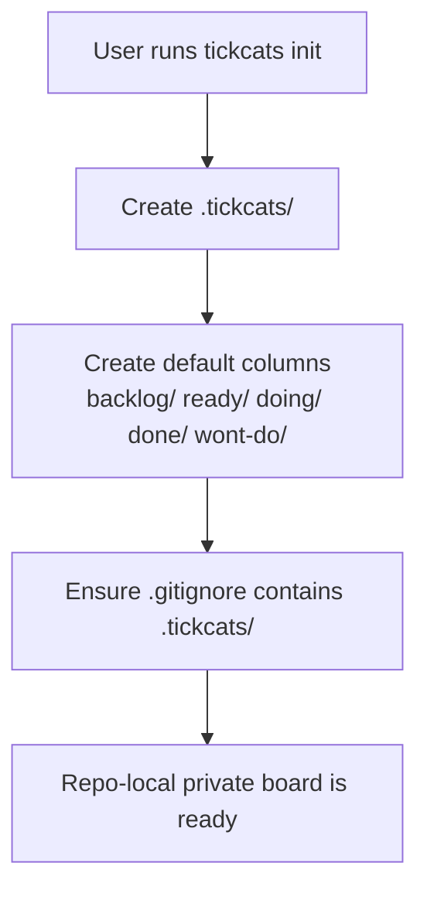
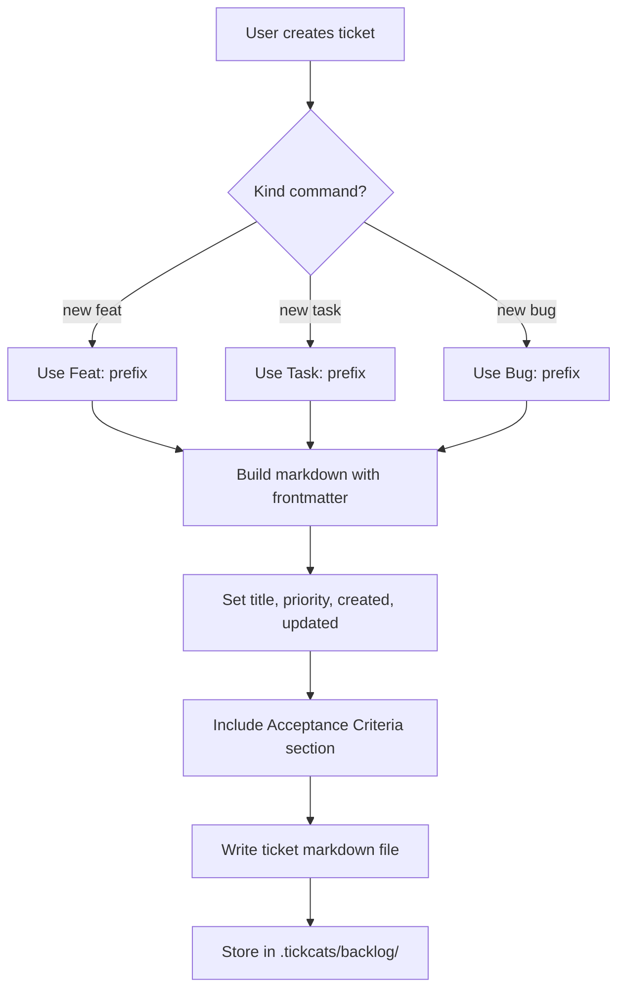
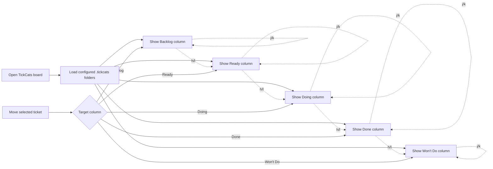
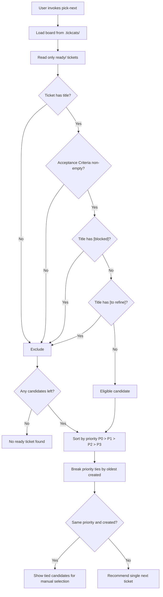
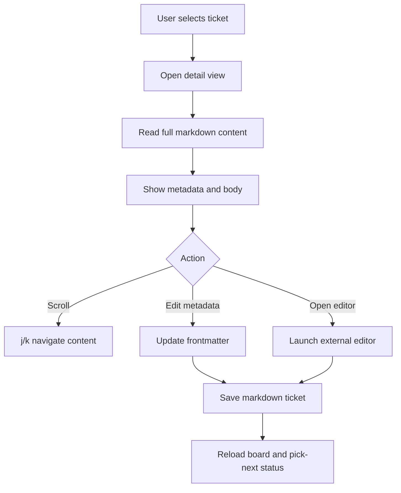
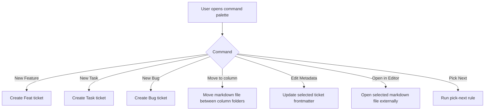

# TickCats User Flow Diagrams

These Mermaid diagrams summarize the v1 flows from the PRD and current CLI implementation. Workflow state is derived from ticket column folder location under `.tickcats/`.

## Initialize local board

## Create a ticket

## Board navigation and workflow movement

## Pick next ready ticket

## Inspect and refine a ticket

## Command palette actions

